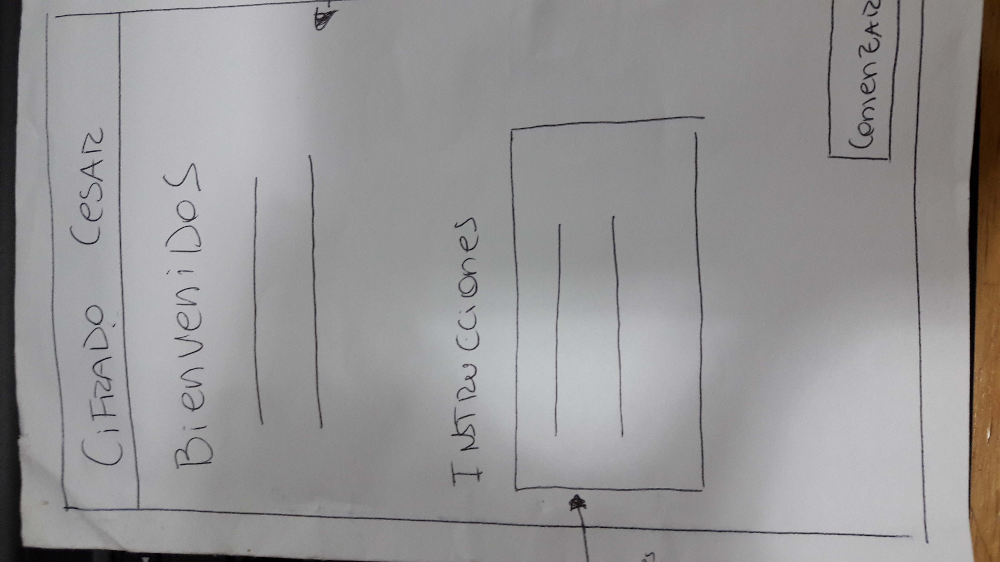

# Respuesta Secreta

***
Es una aplicación para que jovenes puedan enviar secretos en código, secretos que solamente ellos sabran como funciona y solo ellos sabran el mensaje que se encuentra oculto.

## Como funciona:

* El usuario debe entrar a la pagina y para que tambien tenga una pequeña idea de como funciona la apliación, debera seleccionar el botón que dice instrucciones y se desplazara un imagen con una pequeña instrucción. 

* Al seleccionar el botón comenzar enviara al usuario a la segunda pagina que es donde podra hacer su mensaje secreto.

* Aparece una pequeña instrucción para que agregue el numero de desplazamiento y se encuentra una pequeña caja para agregar el numero de desplazamiento que puede ser el número que el usuario desee.

* Lo siguiente es agregar un texto en la caja que corresponde solamente con mayúscula y elegir si quiere cifrar o descifrar. El resultado aparecera en la otra caja, y si quiere cifrar o descifrar el resultado tiene que copiar y pegar en la caja donde se ingresa el texto y seleccionar el botón de la función que desee hacer.

Si deseas ver la pagina aquí te dejo el link [aquí](https://carolinaolatev.github.io/SCL008-Cipher/src/index.html)

## Principales usuarios:

Esta aplicación fue creada para jovenes entre 17 y 20 años de edad, para que puedan enviar mensajes seguros y que solamente ellos sepan de que trata.

## Objetivos:

Los objetivos son principalemte cifrar y descifrar mensajes que la gente envié a las personas de sea y que puedan cifrar o descifrar el mensaje.

## Problemas:

Esta aplicación está resolviendo los problemas de los jovenes ya que algunas personas tienden a tener problemas ocultando sus mensajes, mensajes que quizas no quieren que otras personas lean y con esta aplicación ese problema no existirá ya que solo los jovenes que reciban el mensaje podrán saber de que se trata.

## Proceso y diseño de la aplicación:

* La decisión de elegir el fondo de ese tono fue porque es bastante misterioso si yo veo un fondo así no me dice mucho entonces me da bastante misterio.

* Preferi utilizar un despliegue de las instrucciones ya que particularmente a los jovenes no les gusta leer mucho en una pagina le gusta ver resultado rapido y por eso preferi agregar una imagen que explique las instrucciones.

## Diseño de flujo:

Primera pagina:

Despliegue de instrucciones:

Segunda pagina:

## Planificación:

El primer paso para la creación del diseño web fue la planificación, pensando siempre desde el ambito del usuario. 
Puedes revisar la planificación [aquí](https://trello.com/b/YyiPFTyI/cifrado-cesar)

